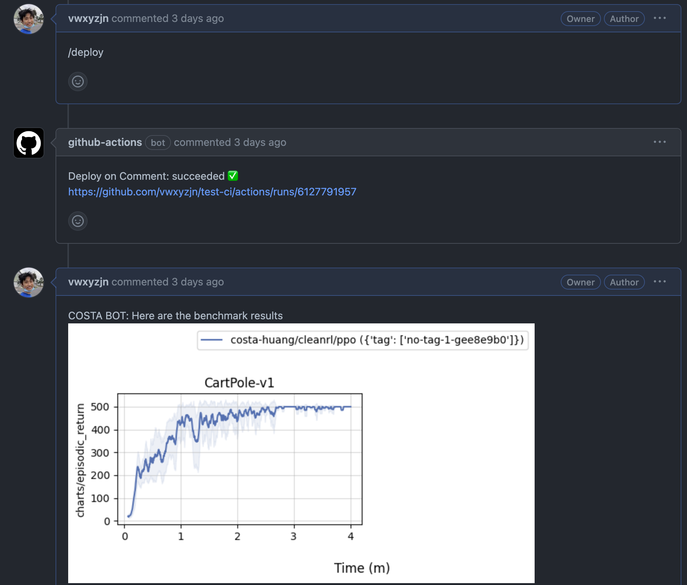
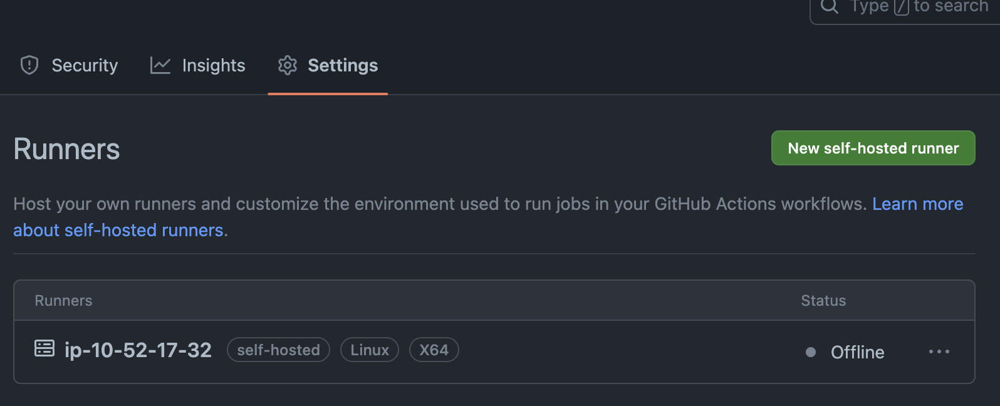
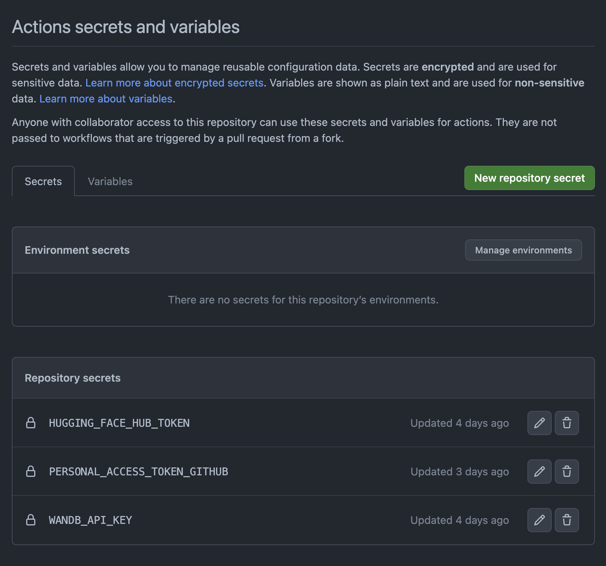

# Benchmark-CI
 
This is a project setting up automatic benchmark experiments with CI triggered by github comments.

Basically, we want to input a command in the issue like `/deploy` and our CI will run trigger the benchmark experiments and report the results back to the issue, like this:

## Basic design

The process is as follows:

1. In `.github/workflows/blank.yml` we trigger the CI when there is a `/deploy` comment in the issue.
1. The CI runs `benchmark/benchmark_and_report.sh`
    1. The script with run `benchmark/benchmark.sh` to run the benchmark experiments in a SLURM cluster.
    1. The script then parse the job ids and run a dependency job `sbatch --dependency=afterany:$job_ids benchmark/post_github_comment.sbatch`, basically invoking the script `benchmark/post_github_comment.py` to post the benchmark results to the issue once all the experiments finished.

## Requirement

* You need a slurm cluster and use its head node to set up a Github self-hosted runner that has access to the `sbatch` command.

* You need to set up the required secrets, which are:
    * `HUGGING_FACE_HUB_TOKEN`: a token to access the HuggingFace hub.
    * `PERSONAL_ACCESS_TOKEN_GITHUB`: a token to access the Github API. This is required because the Github action token only lasts for the duration of the workflow, which is not enough for the benchmark experiments to finish.
    * `WANDB_API_KEY`: a token to access the Weights and Biases API.

## Reference

* https://dev.to/zirkelc/trigger-github-workflow-for-comment-on-pull-request-45l2

